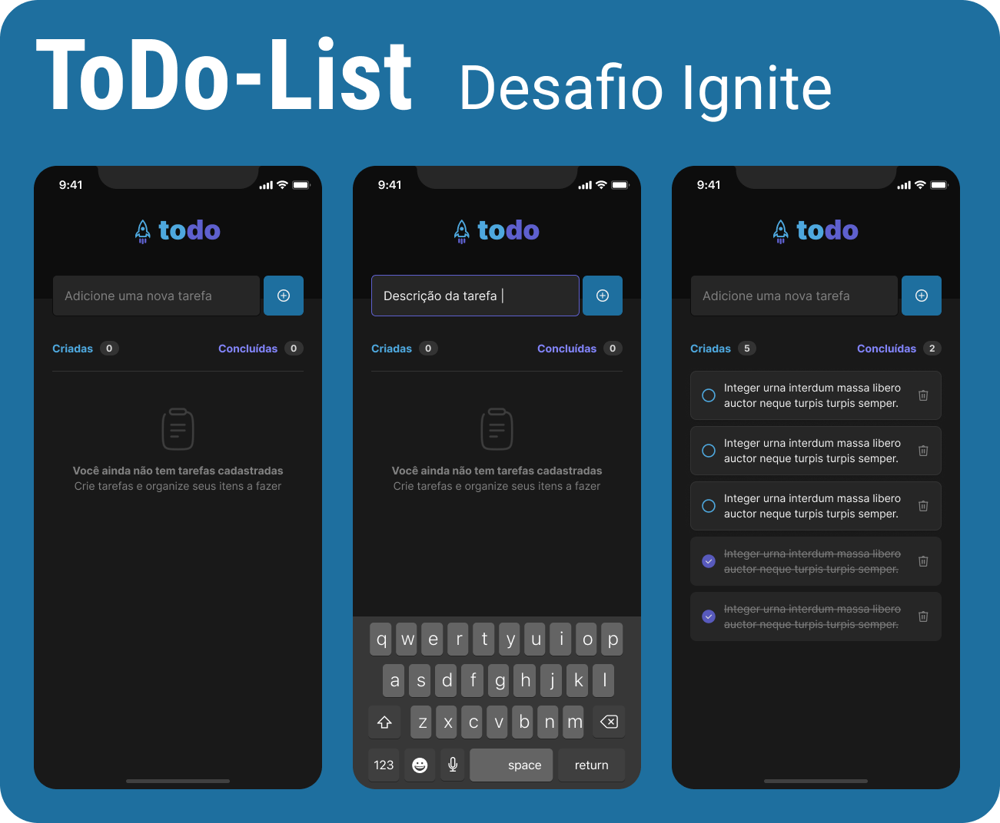

<p align="center">
  
    
</p>


<h1 align="center">
  Todo List App
</h1>
<p align="center">
  Challenge 1 - Learning about React Native Concepts
</p>


## 💻 About Project

Develop a **ToDo-List**, a task control application, which contains the following features: 

- Add a new task.
- Mark and clear a task as complete.
- Remove a task from the listing.
- Show progress on task completion.

The challenge here is use only Expo Managed Workflow and the Core Components and style with minimal external libraries.


## 🔧 Technologies used

- [React Native](https://reactnative.dev/)
- [TypeScript](https://www.typescriptlang.org/)
- [react-native-svg](https://docs.expo.dev/versions/latest/sdk/svg/)


You can see the desktop version **live** [here](https://todo-list-web-ten.vercel.app/).
Or the desktop **repository** [here](https://github.com/edu2andrade/todo-list-web).

---

## :octocat: How to test and install

### You'll need:
- [Expo-CLI](https://docs.expo.dev/get-started/installation/)

Clone this repository:

```sh
git clone https://github.com/edu2andrade/todo-list.git
```

Install dependencies:

```sh
npm install | npm i
```

Start development environment:

```sh
npm run start
```

or:

```sh
expo start
```


## 📝 License

This project is under [MIT License](./LICENSE).


## 👽 Author

Made with 🤘 by [Eduardo Andrade](https://andradept.com/)
